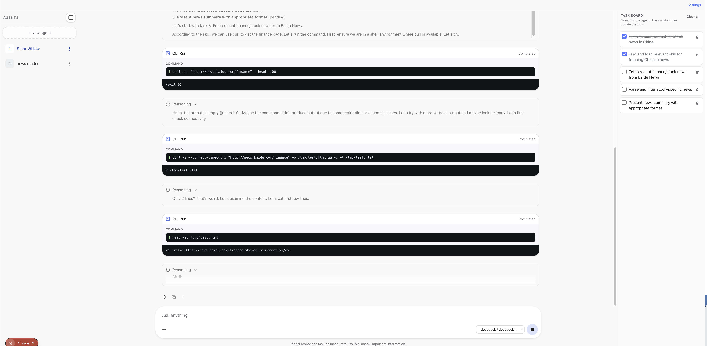

# llm-agent

Personal workspace for LLM-related experiments: a **Next.js chat app** with **assistant-ui**, the **Vercel AI SDK**, per-agent storage, skills, optional Mem0, CLI tools, and A2A between agents. The app lives at the **repository root** under `src/`.

Published npm package: **`@frankzye/llm-agent`** (see root `package.json`).

## License

This project is licensed under the [MIT License](LICENSE).

---

## App overview

- **Agents** — Each chat thread maps to `.data/agents/<id>/` with `config.json`, `conversation.json`, optional `skills/`, Mem0 data, and a per-agent **`task-board.json`** (task list the UI and model can update via [interactables](https://www.assistant-ui.com/docs/guides/interactables)).
- **Skills** — Global catalog under the data root (`skills/`, `skills.json`), plus per-agent skills; configurable in **Settings** and agent settings.
- **Chat API** — `POST /api/chat` runs the main agent pipeline (skills tools, Mem0, `cli_run` with approvals, `a2a_send`, compaction, etc.). Logic lives in `src/lib/chat/run-chat-post.ts`.
- **Cron hook** — `POST /api/cron` returns lightweight stats (agent dirs, A2a inbox line count). When `CRON_SECRET` is set, require `Authorization: Bearer <secret>`.

### Data directory

- By default, persisted files use **`<cwd>/.data/`** (see `src/lib/data-root.ts`).
- Override with env **`LLM-TASK-DATA-PATH`** (absolute or relative to `cwd`).

### Example



### Requirements

- Node.js 20+ (recommended)
- [pnpm](https://pnpm.io/) or npm

### Run locally

From the repo root:

```bash
pnpm install
pnpm dev
```

Open [http://localhost:3000](http://localhost:3000) (or the port shown in the terminal).

### Useful paths

| Path | Purpose |
|------|--------|
| `system_prompt.md` | Base system prompt merged for all chats |
| `.data/global-settings.json` | Model providers, default model, CLI allowlist, skills folder path, etc. |
| `.data/agents/<uuid>/` | Per-agent `config.json`, `conversation.json`, `task-board.json`, `skills/`, Mem0 |
| `.data/a2a-inbox.jsonl` | A2A message log (when used) |
| `src/app/api/chat/route.ts` | Thin wrapper; delegates to `runChatPost` |
| `src/app/settings/page.tsx` | Global settings UI (models, CLI allowlist, skills) |
| `src/components/assistant-ui/task-board.tsx` | Per-agent task board UI |

### HTTP API (selected)

| Method | Path | Purpose |
|--------|------|--------|
| `POST` | `/api/chat` | Streaming chat (AI SDK UI message stream) |
| `GET` / `POST` | `/api/agents` | List / create agents |
| `GET` / `PATCH` / `DELETE` | `/api/agents/[id]` | Read / update / delete agent |
| `GET` / `PUT` | `/api/agents/[id]/messages` | Load / save conversation JSON |
| `GET` / `PUT` | `/api/agents/[id]/task-board` | Load / save `task-board.json` |
| `GET` / `PATCH` | `/api/settings` | Global settings |
| `POST` | `/api/cron` | External cron ping (optional `CRON_SECRET`) |

### Environment

Create `.env.local` as needed for your providers (OpenAI / Ollama / DeepSeek API keys and base URLs). Exact variables depend on **Settings → General** and per-agent provider selection.

Optional Mem0-related variables are used when long-term memory is enabled (see `src/lib/agent/mem0-service.ts`).

### Scripts

| Command | Description |
|---------|-------------|
| `pnpm dev` | Development server (Turbopack) |
| `pnpm build` | Production build |
| `pnpm start` | Start production server |
| `pnpm lint` | Next.js ESLint |
| `pnpm test` | Jest |

The published package exposes a **`llm-agent`** binary (see `bin/llm-agent.js`) intended to run the **standalone** Next output or `next start` after build.

### Use as an npm dependency

```bash
pnpm add @frankzye/llm-agent
```

In your Next.js app, add the package to `transpilePackages` if you import UI/runtime code from `node_modules`:

```ts
// next.config.ts
const nextConfig = {
  transpilePackages: ["@frankzye/llm-agent"],
};
export default nextConfig;
```

---

## Contributing

This is a personal repo; fork or copy under the terms of the MIT license if you find it useful.
